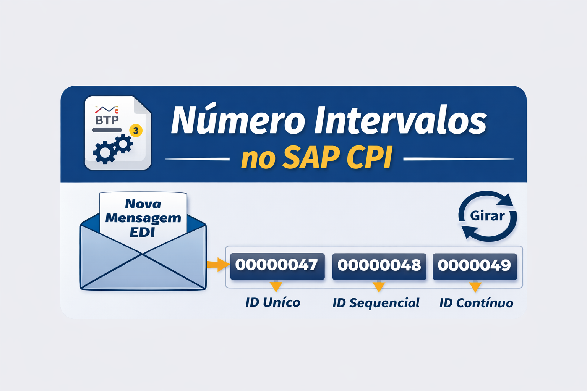
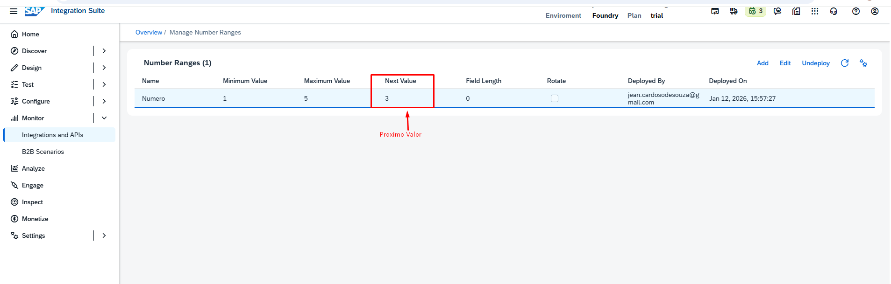
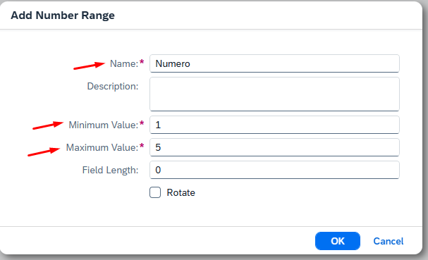

# Número Intervalos no SAP CPI (SAP BTP)

---

## 📌 O que é Número Intervalos?

No **SAP Cloud Integration (CPI)**, **Número Intervalos (Number Range)** é um recurso utilizado para gerar **números sequenciais únicos**, de forma controlada e automática.

Ele é muito usado em integrações que precisam de:

- Identificadores únicos
- Numeração contínua
- Controle de mensagens

Um exemplo clássico é o processamento de **mensagens EDI**, onde cada documento precisa ter um número único de controle.

---

## ❓ Por que o Número Intervalos é importante?

Em integrações, principalmente **B2B / EDI**, cada mensagem enviada **não pode se repetir**.

O **Número Intervalos** garante isso automaticamente, sem que seja necessário criar lógica manual no iFlow.

### ✅ Benefícios
- Geração automática de números únicos  
- Evita duplicidade  
- Centraliza o controle da numeração  
- Funciona para múltiplos iFlows  
- Ideal para cenários EDI, EDIFACT e integrações críticas  

---

## 📍 Onde configurar o Number Range?

No **SAP BTP**, dentro do **SAP Cloud Integration**, o Number Range é criado em:

> **Monitor → Manage Stores → Number Ranges**

---

## 🔎 Visão geral do funcionamento

Cada nova mensagem consome um número sequencial automaticamente.

---

## ⚙️ Principais atributos do Número Intervalos

| Atributo | Descrição |
|--------|----------|
| **Nome** | Nome do intervalo numérico |
| **Valor Mínimo** | Número inicial da sequência |
| **Valor Máximo** | Limite máximo permitido |
| **Comprimento do Campo** | Quantidade de dígitos (zero padding) |
| **Próximo Valor** | Próximo número a ser gerado |
| **Girar (Reset)** | Retorna ao valor mínimo ao atingir o máximo |

> ⚠️ Neste exemplo, quando chegar em **5**, o processo para por atingir o valor máximo.

---

## 🧩 Exemplo prático – iFlow para baixar

